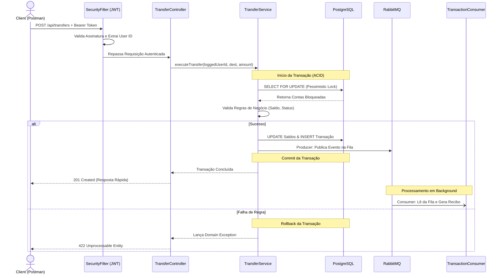

# 🚀 Payment Engine API

Uma API RESTful projetada para processar transferências financeiras entre contas de forma segura, assíncrona e eficiente.

Este projeto foi construído para demonstrar práticas modernas de engenharia backend e **Clean Architecture**, com foco em integridade de dados, transações atômicas, segurança *stateless* e processamento assíncrono — requisitos críticos para arquiteturas de bancos e fintechs.

## 🛠️ Tecnologias
- **Java 21**
- **Spring Boot 3** (Web, Data JPA, Security, AMQP, Validation)
- **PostgreSQL** (Banco de Dados Relacional)
- **RabbitMQ** (Mensageria / Event-Driven)
- **JWT (Auth0)** (Autenticação e Criptografia)
- **Docker & Docker Compose** (Containerização da Infraestrutura)
- **JUnit 5 & Mockito** (Testes Automatizados)
- **Gradle** (Ferramenta de Build)

## 🏗️ Arquitetura e Regras de Negócio

Para garantir que o sistema seja seguro para operações financeiras reais, as seguintes decisões arquiteturais foram aplicadas:

- **Transações ACID:** A anotação `@Transactional` garante que uma transferência seja completamente atômica. Se ocorrer uma falha, o sistema faz o *rollback* automático, evitando perda financeira.
- **Controle de Concorrência:** Implementação de **Pessimistic Locking** para evitar *race conditions*. Previne falhas de concorrência e o problema de gasto duplo (*double-spending*).
- **Segurança Blindada (ID Spoofing):** A API não confia em dados de origem enviados pelo cliente no corpo da requisição. O ID da conta de origem é extraído diretamente e de forma segura da assinatura do **Token JWT** do usuário autenticado.
- **Mensageria Assíncrona (RabbitMQ):** Processos pesados e secundários (como geração de recibos ou notificações) foram desacoplados da *thread* principal. O motor de pagamentos apenas publica o evento na fila e responde ao cliente em milissegundos.
- **Validações Fail-Fast:** Utilização do Jakarta Validation para bloquear dados inválidos antes de atingirem a camada de domínio.

### 📊 Fluxo de Arquitetura (Security, Core & Async)


## 🚀 Como Executar

1. **Clone o repositório:**
```bash
git clone https://github.com/seu-usuario/payment-engine.git
cd payment-engine
```

2. **Suba a Infraestrutura (PostgreSQL + RabbitMQ) via Docker:**
```Bash
docker-compose up -d
```
_O RabbitMQ estará disponível em http://localhost:15672 (guest/guest)._

3. **Rode a aplicação:**
```Bash
  ./gradlew bootRun
```
_O servidor iniciará na porta http://localhost:8080_


## 📖 Documentação da API


1. **Autenticação**
- Registrar Novo Usuário
- Cria um usuário com senha criptografada (BCrypt).
- Endpoint: _POST /api/auth/register_

   **Body:**
```Bash
{
  "email": "dev@banco.com",
  "password": "senha-segura"
}
```

**Gerar Token (Login)**
- Endpoint: _POST /api/auth/login_
- Body: (Mesmo formato do registro)
- Resposta (200 OK): Devolve o token JWT.

2. **Transferência de Fundos**
- Processa uma transferência entre duas contas ativas
- Endpoint: _POST /api/transfers_
- **Corpo da Requisição (JSON):**
```Bash
{
"sourceAccountId": 1,
"destinationAccountId": 2,
"amount": 250.00
}
```
✅ **Resposta de Sucesso (201 Created):**
```Bash
JSON
{
"transactionId": 1,
"sourceAccountId": 1,
"destinationAccountId": 2,
"amount": 250.00,
"status": "SUCCESS",
"createdAt": "2026-03-19T15:30:00"
}
```

❌ **Resposta de Erro - Saldo Insuficiente (422 Unprocessable Entity):**
```Bash
{
"error": "Unprocessable Entity",
"message": "Insufficient balance in source account",
"details": [],
"timestamp": "2026-03-19T15:31:00"
}
```

🧪 **Testes Automatizados**

- Este projeto inclui uma suíte de testes automatizados (Unitários e de Integração com MockMvc) cobrindo tanto as regras de negócio quanto a camada Web.
- Para rodar a esteira de testes, execute:
```Bash
./gradlew test
```

## 👨‍💻 Autor

Desenvolvido por **Magdiel Rocha** - Back-end Developer.

[](https://www.linkedin.com/in/magdiel-rocha/)
[](https://github.com/magdielrocha)

## 📄 Licença

Este projeto está sob a licença MIT - veja o arquivo [LICENSE](LICENSE) para mais detalhes.

